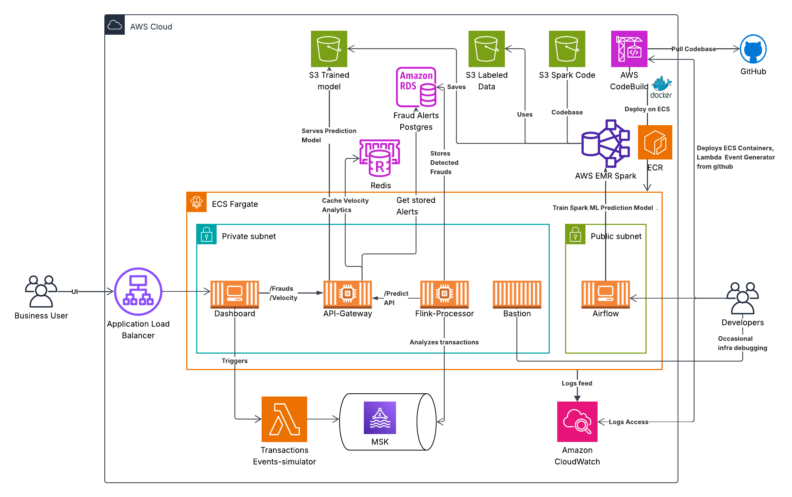
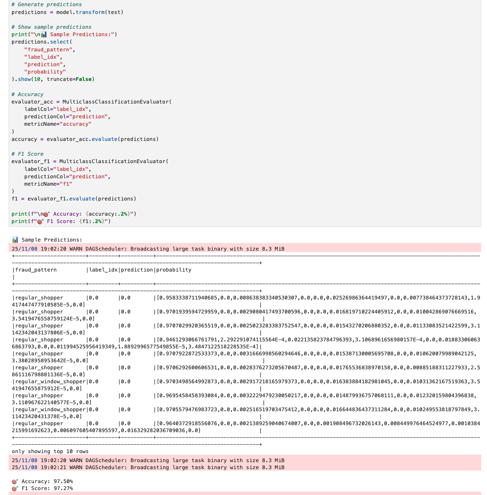

# 🚨 PatternAlarm

**Real-time fraud detection pipeline** — Kafka ingests 10K+ events/minute, Flink processes streaming aggregates across 3 domains, Spark ML scores with 97.5% accuracy.

> *Part of my [Scalefine.ai](https://scalefine.ai) portfolio — exploring streaming patterns for real-time ML.*


<!-- TODO: Add GIF of live dashboard -->

---

## 🎯 Context

This is a **sandbox project** exploring how streaming architectures handle fraud detection patterns. The goal was to wire together Kafka → Flink → Spark ML end-to-end and see where the bottlenecks actually are.

**What I wanted to prove:**
- Can a single Flink worker keep up with 10K events/min while calling an ML API?
- How bad is Spark job overhead for real-time inference? (Spoiler: very bad — see [Performance Case Study](#-performance-case-study-79x-throughput-improvement))
- What does it cost to run MSK + ECS + RDS for a streaming pipeline?

**Domains covered:** The simulator generates transactions for fintech, gaming, and e-commerce — same pipeline, different fraud patterns.

---

## 📊 Capacity & Cost

| Configuration | Throughput | Monthly Cost | Cost per 1M events |
|---------------|------------|--------------|-------------------|
| **1 worker** | ~3,700/min | ~$300 | ~$0.05 |
| **3 workers** | ~12,000/min | ~$450 | ~$0.025 |
| **10 workers** | ~35,000/min | ~$800 | ~$0.015 |

*Measured during load tests. Auto-scales to zero when idle.*

---

## ✨ Results

| Metric | Value | Notes |
|--------|-------|-------|
| **Throughput** | 3.7K events/min (1 worker) | Scales horizontally |
| **ML Accuracy** | 97.5% (F1: 97.27%) | 10-class RandomForest |
| **Detection Latency** | < 3 seconds | End-to-end |
| **Batch Optimization** | 79x faster | See case study below |

> 📖 *The 79x improvement was the interesting part — [write-up here](https://scalefine.ai/blog/pattern-alarm-performance-case-study).*

---

## 🏗️ Architecture




### Services

| Service | Purpose | Tech |
|---------|---------|------|
| **`event-simulator/`** | Lambda function generating fictive transactions with configurable fraud %. Triggered by dashboard, injects into Kafka topics. | Python, AWS Lambda |
| **`flink-processor/`** | Processes Kafka streams from 3 domains (fintech/ecommerce/gaming). Bronze→Silver (shared features) →Gold (ML scoring). Saves fraud alerts to PostgreSQL. | Scala, Flink, ECS Fargate |
| **`api-gateway/`** | Serves ML predictions, velocity analytics, and fraud alerts with related transactions. Loads trained model from S3. | Python, FastAPI, Spark ML |
| **`dashboard/`** | UI to trigger transaction pipeline, monitor fraud status, and visualize real-time charts. | Java, Spring Boot, Chart.js |
| **`airflow/`** | Productionizes model training pipeline: extract features → train model → validate → save to S3. | Python, Airflow, EMR Serverless |
| **`notebook/`** | Preliminary model development — cross-domain RandomForest achieving 97.5% accuracy on 10 fraud types. | PySpark, Jupyter |

### Tech Stack

| Layer | Technology | Why This Choice |
|-------|------------|-----------------|
| **Ingestion** | AWS Lambda → MSK (Kafka) | Scalable data pipelines, multi-topic architecture |
| **Stream Processing** | Apache Flink (ECS Fargate) | Real-time analytics with exactly-once semantics |
| **ML Scoring** | Spark MLlib (RandomForest) | Production mlops patterns, batch-optimized inference |
| **Storage** | PostgreSQL (RDS) + Redis | Time-series patterns, sub-100ms query caching |
| **API** | FastAPI (async) | High-throughput model serving |
| **Dashboard** | Spring Boot + Thymeleaf + Chart.js | Real-time visualization |
| **Orchestration** | Apache Airflow + EMR Serverless | MLOps workflow automation |
| **Infrastructure** | Terraform (IaC) | Reproducible cloud architecture |

> *Similar stack to what I've used in gaming analytics roles. [More projects →](https://scalefine.ai/portfolio)*

---

## 📸 Screenshots

### Live Dashboard
Real-time fraud alerts with velocity graph and severity indicators.


### ML Pipeline (Airflow)
Orchestrated training pipeline: feature extraction → model training → validation (EMR Serverless).


### Model Performance
97.5% accuracy with per-class breakdown across 10 fraud types.



### Infrastructure Costs
Optimized from $26/day to ~$10/day with auto-scaling.


---

## 🔬 Performance Case Study: 79x Throughput Improvement

### The Problem

During load testing, ML predictions were timing out under backlog pressure. Individual API calls took ~950ms each, limiting throughput to **63 predictions/minute** — far below the 10K/min target.

### Investigation

Isolated the API Gateway and profiled each step:

```
⏱️ [5] createDataFrame:  412ms (43%)
⏱️ [6] model.transform:   89ms  (9%)
⏱️ [7] collect:          773ms (81%)  ← BOTTLENECK
```

**Finding:** 81% of time was fixed overhead (Spark job setup), not actual inference. Adding workers wouldn't fix this.

### Solution: Batch Processing

Switched from async single requests to synchronous batch processing:

**Before:**
```scala
// 1 request = 1 Spark job = 950ms
AsyncDataStream.unorderedWait(aggregates, fraudScoringAsyncFunction, ...)
```

**After:**
```scala
// 100 requests = 1 Spark job = 1200ms total = 12ms each
aggregates.process(new FraudScoringBatchFunction(batchSize = 100))
```

### Results

| Metric | Before | After | Improvement |
|--------|--------|-------|-------------|
| Latency/prediction | 950ms | 12ms | **79x faster** |
| Throughput | 63/min | 3,700/min | **59x higher** |
| NORMAL mode (10K/min) | ❌ | ✅ (with 3 workers) | — |

### Capacity Planning

| Configuration | Throughput | Supported Load |
|---------------|------------|----------------|
| 1 worker, single requests | 63/min | ❌ None |
| 1 worker, batch 100 | 3,700/min | ✅ MINI |
| 3-4 workers, batch 100 | 12,000/min | ✅ NORMAL |
| 10+ workers | 35,000/min | ✅ PEAK |

> 💡 *Takeaway: Profile before scaling. This applies to any Spark-based inference.*

---

## 🎯 Detection Results

From NORMAL load test (~10K events/min with 3 workers):

| Metric | Value |
|--------|-------|
| Alerts generated | 16 |
| True fraud detected | 13/32 (40.6%) |
| Critical severity | 5 |
| High severity | 9 |

**Alert Types Detected:**
- `suspicious_activity` (8)
- `account_takeover` (3)
- `chargeback_fraud` (2)
- `money_laundering` (2)
- `structuring` (1)

---

## 🚀 Quick Start

### Prerequisites

- AWS CLI configured
- Terraform >= 1.0
- Docker + Docker Compose
- Python 3.11+
- Java 17

### 1. Local Development (Docker Compose)

```bash
# Clone
git clone https://github.com/yourusername/patternalarm.git
cd patternalarm

# Start local stack (Kafka, PostgreSQL, Redis)
cd scripts
cp config.example.conf config.conf  # Edit with your settings
docker-compose up -d

# Run setup scripts in order
./1-create-kafka-topics.sh
./2-rds-schema.sql        # Apply to local PostgreSQL
./3-upload-training-data.sh
```

### 2. Deploy to AWS (Terraform)

```bash
cd infra/terraform
terraform init
terraform apply

# Then run the same scripts against AWS resources
cd ../scripts
./1-create-kafka-topics.sh
./3-upload-training-data.sh
```

### 3. Run Load Test

```bash
# From dashboard UI or CLI
curl -X POST "https://<dashboard>/api/test/execute" \
  -d "domain=gaming&loadLevel=normal"
```

---

## 💰 Cost Optimization

Real AWS billing data from development:

| Metric | Value |
|--------|-------|
| **Total (6 days)** | $92.88 |
| **Average daily** | $15.48 |
| **Optimized daily** | ~$10/day |
| **Monthly estimate** | **~$300** |

**Cost breakdown:** MSK (Kafka) ~40%, ECS (Flink) ~25%, RDS ~20%, Other ~15%

**Savings tactics:**
- ECS services scale to 0 when idle
- MSK paused between tests
- NAT Gateway minimized
- EMR Serverless for Airflow jobs (pay per use)

> *Detailed cost breakdown in my [blog post on cloud cost patterns](https://scalefine.ai/blog/aws-streaming-costs).*

---

## 📚 Lessons Learned

1. **Batch > Single requests** for Spark ML — fixed overhead dominates individual inference
2. **Profile before scaling** — adding workers wouldn't have fixed the real bottleneck
3. **MSK is expensive** — consider Redpanda or self-hosted Kafka for dev environments
4. **Auto-scale aggressively** — cloud costs compound faster than expected
5. **EMR Serverless** — perfect for sporadic ML training (vs always-on EMR cluster)

---

## 🛠️ What's Inside

| Area | What I Used | Notes |
|------|-------------|-------|
| **Streaming** | Kafka (MSK), Flink (Scala), Spark ML | Multi-topic, windowing, exactly-once semantics |
| **Data** | PostgreSQL, Redis, FastAPI | Time-series patterns, caching layer |
| **Cloud** | AWS (MSK, RDS, ECS Fargate, EMR Serverless) | Terraform for everything |
| **MLOps** | Airflow, EMR Serverless, S3 model registry | Training pipeline, not just notebooks |
| **The Hard Part** | Batch optimization for Spark inference | See case study — this took a while to figure out |

> *More context on my background: [scalefine.ai/about](https://scalefine.ai/about)*

---

## 🔗 Related Projects

- **[TokenPulse](https://scalefine.ai/portfolio/tokenpulse)** — GenAI cost optimization with LangChain + streaming (coming Feb 2025)
- **[Scalefine Blog](https://scalefine.ai/blog)** — Deep dives on Kafka, Flink, and production ML

---

## 📄 License

MIT

---

## 🙋 Author

**Aurélien Courrèges-Clercq**  
Building streaming pipelines and ML systems.

[Scalefine.ai](https://scalefine.ai) · [LinkedIn](https://linkedin.com/in/yourprofile) · [GitHub](https://github.com/yourusername)