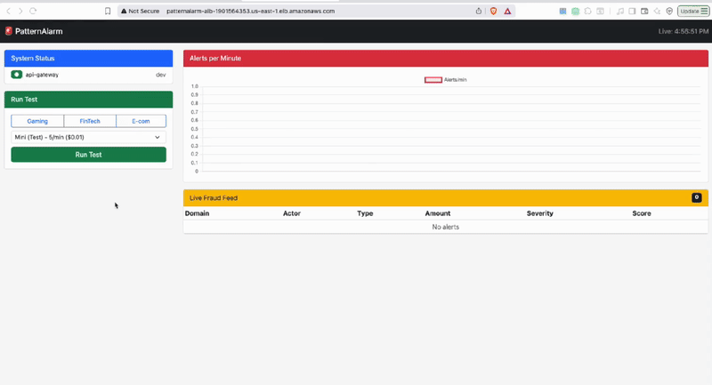
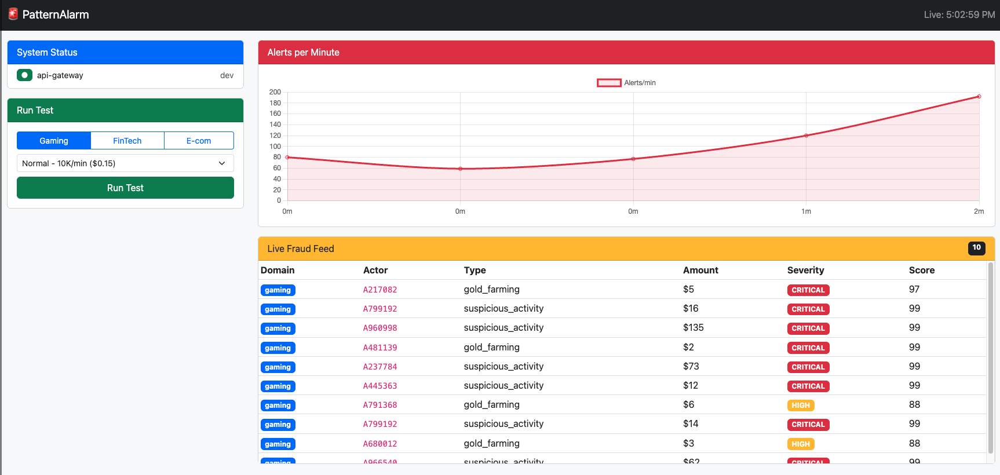
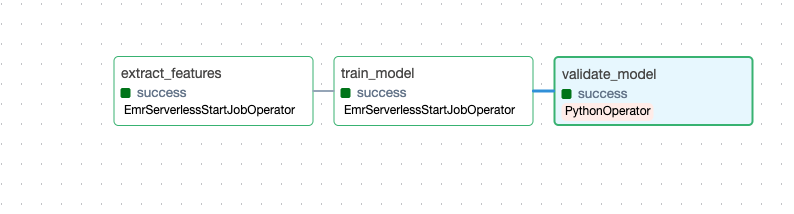
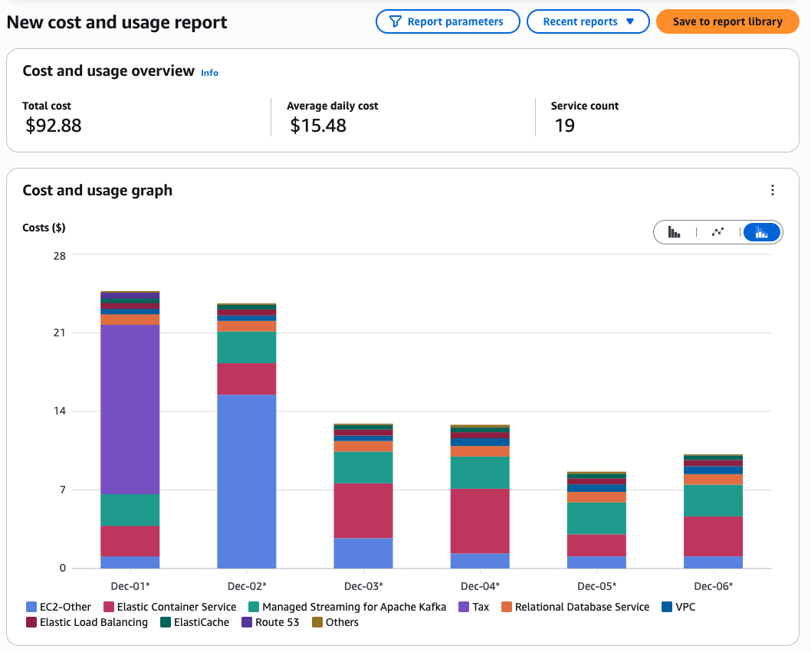

# 🚨 PatternAlarm

**Real-time fraud detection at scale.** Kafka ingests 50K+ events/minute, Flink processes streaming aggregates, Spark ML scores with 97.5% accuracy, all visualized in a live dashboard.

Built for payment fraud, gaming anti-cheat, and IoT anomaly detection.


<!-- TODO: Add GIF of live dashboard -->

---

## ✨ Highlights

| Metric | Value |
|--------|-------|
| **Throughput** | 10K events/min (single worker) |
| **ML Accuracy** | 97.5% |
| **Detection Latency** | < 3 seconds |
| **Batch Optimization** | 79x faster after tuning |

---

## 🏗️ Architecture

```
┌─────────────┐    ┌─────────────┐    ┌─────────────────┐    ┌─────────────┐
│   Lambda    │───▶│    MSK      │───▶│  Flink (ECS)    │───▶│     RDS     │
│ (Generator) │    │   (Kafka)   │    │   Streaming     │    │ (PostgreSQL)│
└─────────────┘    └─────────────┘    └────────┬────────┘    └─────────────┘
                                               │
                                               ▼
                                      ┌─────────────────┐
                                      │  API Gateway    │
                                      │  (FastAPI +     │
                                      │   Spark ML)     │
                                      └────────┬────────┘
                                               │
                                               ▼
                                      ┌─────────────────┐
                                      │   Dashboard     │
                                      │  (Spring Boot)  │
                                      └─────────────────┘
```

### Tech Stack

| Layer | Technology |
|-------|------------|
| Ingestion | AWS Lambda → MSK (Kafka) |
| Stream Processing | Apache Flink (ECS Fargate) |
| ML Scoring | Spark MLlib (RandomForest) |
| Storage | PostgreSQL (RDS) + Redis (ElastiCache) |
| API | FastAPI (async) |
| Dashboard | Spring Boot + Thymeleaf + Chart.js |
| Orchestration | Apache Airflow |
| Infrastructure | Terraform (IaC) |

---

## 📸 Screenshots

### Live Dashboard
Real-time fraud alerts with velocity graph and severity indicators.


<!-- TODO: Add dashboard screenshot -->

### ML Pipeline (Airflow)
Orchestrated training pipeline: feature extraction → model training → validation.


<!-- TODO: Add Airflow screenshot -->

### Model Performance
97.5% accuracy with per-class breakdown across 10 fraud types.


<!-- TODO: Add notebook metrics screenshot -->

### Infrastructure Costs
Optimized from $26/day to ~$10/day with auto-scaling.


<!-- TODO: Add AWS cost screenshot -->

---

## 🔬 Performance Case Study: 79x Throughput Improvement

### The Problem

During load testing, ML predictions were timing out under backlog pressure. Individual API calls took ~950ms each, limiting throughput to **63 predictions/minute** — far below our 10K/min target.

### Investigation

Isolated the API Gateway and profiled each step:

```
⏱️ [5] createDataFrame:  412ms (43%)
⏱️ [6] model.transform:   89ms  (9%)
⏱️ [7] collect:          773ms (81%)  ← BOTTLENECK
```

**Finding:** 81% of time was fixed overhead (Spark job setup), not actual inference.

### Solution: Batch Processing

Switched from async single requests to synchronous batch processing:

**Before:**
```scala
// 1 request = 1 Spark job = 950ms
AsyncDataStream.unorderedWait(aggregates, fraudScoringAsyncFunction, ...)
```

**After:**
```scala
// 100 requests = 1 Spark job = 1200ms total = 12ms each
aggregates.process(new FraudScoringBatchFunction(batchSize = 100))
```

### Results

| Metric | Before | After | Improvement |
|--------|--------|-------|-------------|
| Latency/prediction | 950ms | 12ms | **79x faster** |
| Throughput | 63/min | 3,700/min | **59x higher** |
| NORMAL mode (10K/min) | ❌ | ✅ (with 3 workers) | - |

### Capacity Planning

| Configuration | Throughput | Supported Load |
|---------------|------------|----------------|
| 1 worker, single requests | 63/min | ❌ None |
| 1 worker, batch 100 | 3,700/min | ✅ MINI |
| 3-4 workers, batch 100 | 12,000/min | ✅ NORMAL |
| 10+ workers | 35,000/min | ✅ PEAK |

---

## 🎯 Detection Results

From NORMAL load test (10K events/min):

| Metric | Value |
|--------|-------|
| Alerts generated | 16 |
| True fraud detected | 13/32 (40.6%) |
| Critical severity | 5 |
| High severity | 9 |

**Alert Types Detected:**
- `suspicious_activity` (8)
- `account_takeover` (3)
- `chargeback_fraud` (2)
- `money_laundering` (2)
- `structuring` (1)

---

## 🚀 Quick Start

### Prerequisites

- AWS CLI configured
- Terraform >= 1.0
- Docker
- Python 3.8+
- Java 11 or 17

### Deploy Infrastructure

```bash
cd infra/terraform
terraform init
terraform apply
```

### Run Load Test

```bash
# From dashboard UI or CLI
curl -X POST "https://<dashboard>/api/test/execute" \
  -d "domain=gaming&loadLevel=normal"
```

---

## 💰 Cost Optimization

| Approach | Daily Cost |
|----------|------------|
| Always-on (naive) | $26/day |
| Auto-scale to zero | $10/day |
| **Monthly estimate** | **~$300** |

Key savings:
- ECS services scale to 0 when idle
- MSK paused between tests
- NAT Gateway minimized

---

## 📚 Lessons Learned

1. **Batch > Single requests** for Spark ML — fixed overhead dominates
2. **Profile before scaling** — adding workers wouldn't have fixed the real bottleneck
3. **MSK is expensive** — consider Redpanda or self-hosted Kafka for dev
4. **Auto-scale aggressively** — cloud costs add up fast

---

## 🔧 Local Development

```bash
# Clone
git clone https://github.com/yourusername/patternalarm.git
cd patternalarm

# Python env
python3.8 -m venv venv
source venv/bin/activate
pip install -r requirements.txt

# Run API locally
cd api-gateway
uvicorn src.main:app --reload

# Run dashboard locally
cd dashboard
./mvnw spring-boot:run
```

---

## 📄 License

MIT

---

## 🙋 Author

**[Your Name]**  
Data Engineer | Streaming & ML Systems

[LinkedIn](https://linkedin.com/in/yourprofile) · [Portfolio](https://yourportfolio.com)